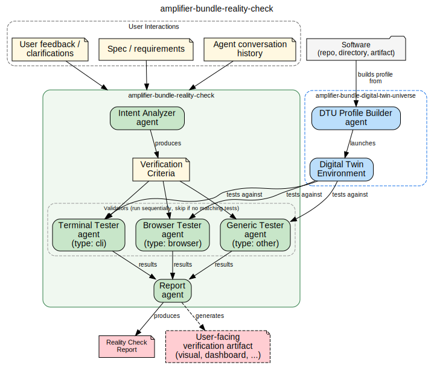

# Amplifier Bundle Reality Check

AI-generated software is typically verified in the same environment and context it was built in.
This leads to agents claiming "done" when the work doesn't actually meet the user's intent,
hasn't been tested in a real environment, or only passes in the narrow conditions of the dev session.

Amplifier Reality Check closes that gap: it captures what the user actually wanted,
derives verifiable criteria, and tests the result in a
[Digital Twin Universe](https://github.com/microsoft/amplifier-bundle-digital-twin-universe)
environment so that "done" means done.




## Prerequisites

This bundle depends on the Digital Twin Universe bundle (which itself depends on
[amplifier-bundle-gitea](https://github.com/microsoft/amplifier-bundle-gitea)).
See their READMEs for prerequisite setup:

- [Digital Twin Universe prerequisites](https://github.com/microsoft/amplifier-bundle-digital-twin-universe#prerequisites)
- [Gitea prerequisites](https://github.com/microsoft/amplifier-bundle-gitea#prerequisites)
- [Terminal Tester prerequisites](https://github.com/microsoft/amplifier-bundle-terminal-tester#prerequisites) (for CLI/TUI validation)


## Installation

`--app` composes the bundle onto every Amplifier session. Remove it to only register the bundle for later activation with `amplifier bundle use`.

```bash
amplifier bundle add git+https://github.com/microsoft/amplifier-bundle-reality-check@main --app
```

To compose into an existing bundle:
```bash
amplifier bundle add "git+https://github.com/microsoft/amplifier-bundle-reality-check@main#subdirectory=behaviors/reality-check.yaml" --app
```


## Agents

- **[Intent Analyzer](agents/intent-analyzer.md)** -- reads user interactions (spec, conversation history, feedback) and produces structured acceptance tests. The "what does done mean?" agent.
- **[Browser Tester](agents/browser-tester.md)** -- drives a real browser against web UIs to verify they actually work end-to-end.
- **[Terminal Tester](agents/terminal-tester.md)** -- drives terminal applications inside DTU environments to verify CLI/TUI apps work end-to-end. Uses the DTU exec bridge pattern with `terminal_inspector`.
- **[Generic Tester](agents/generic-tester.md)** -- runs shell-level checks (HTTP probes, file checks, process inspection) inside DTU environments to verify headless software like APIs, services, libraries, and background workers. Uses the DTU exec bridge pattern with `bash`.
- **[Report](agents/report.md)** -- consumes acceptance tests and validator results, produces a structured gap analysis and a self-contained HTML report.


## Recipes

- **[reality-check-pipeline](recipes/reality-check-pipeline.yaml)** -- runs the full pipeline end-to-end: derives acceptance tests from user intent, deploys the software in a Digital Twin Universe environment, runs validators sequentially (terminal, browser, and generic -- each exits immediately if no matching tests exist), and produces a gap analysis report. The DTU environment is left running so the user can interact with the deployed software.
  - Sample prompt: 
  ```
  Run the reality-check-pipeline recipe against the software at ./my-app with spec at ./spec.md and conversation at ./conversation.json
  ```

## Development

See [docs/DEVELOPMENT.md](docs/DEVELOPMENT.md).

## Contributing

> [!NOTE]
> This project is not currently accepting external contributions, but we're actively working toward opening this up. We value community input and look forward to collaborating in the future. For now, feel free to fork and experiment!

Most contributions require you to agree to a
Contributor License Agreement (CLA) declaring that you have the right to, and actually do, grant us
the rights to use your contribution. For details, visit [Contributor License Agreements](https://cla.opensource.microsoft.com).

When you submit a pull request, a CLA bot will automatically determine whether you need to provide
a CLA and decorate the PR appropriately (e.g., status check, comment). Simply follow the instructions
provided by the bot. You will only need to do this once across all repos using our CLA.

This project has adopted the [Microsoft Open Source Code of Conduct](https://opensource.microsoft.com/codeofconduct/).
For more information see the [Code of Conduct FAQ](https://opensource.microsoft.com/codeofconduct/faq/) or
contact [opencode@microsoft.com](mailto:opencode@microsoft.com) with any additional questions or comments.

## Trademarks

This project may contain trademarks or logos for projects, products, or services. Authorized use of Microsoft
trademarks or logos is subject to and must follow
[Microsoft's Trademark & Brand Guidelines](https://www.microsoft.com/legal/intellectualproperty/trademarks/usage/general).
Use of Microsoft trademarks or logos in modified versions of this project must not cause confusion or imply Microsoft sponsorship.
Any use of third-party trademarks or logos are subject to those third-party's policies.
